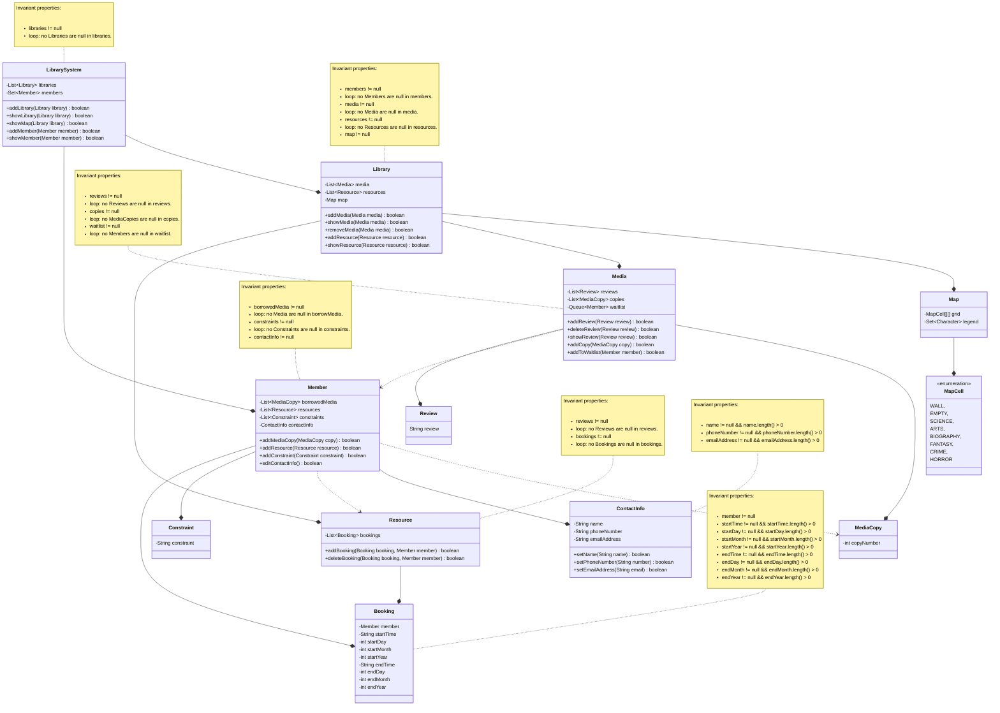

# Domain model

## Resources

* I got inspiration for some book categories here: <https://www.bookbeaver.co.uk/blog/different-types-of-books>
* I got info on what info bookings require from here: <https://riverlanding.com/blog/what-does-a-hotel-require-from-you-to-book-a-room/>

## Diagram

Here is the diagram for my domain model

